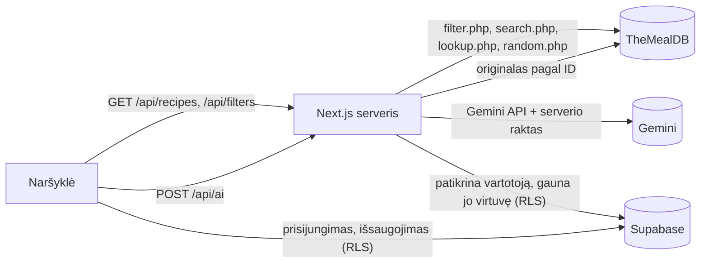

# Fridge Rescue

Aplikacija, kuri padeda nuspręsti, ką gaminti iš turimų produktų. Receptai gaunami iš **TheMealDB**, vartotojų paskyros ir išsaugoti duomenys laikomi **Supabase**, o receptai pritaikomi vartotojo situacijai su **Gemini**.

- Vieša versija: **https://fridge-mu-green.vercel.app**
- Kodas: **https://github.com/g576mjfp68-wq/fridge-rescue**
- Paaiškinimai gynimui: [docs/KONSPEKTAS.md](docs/KONSPEKTAS.md)

## Ką galima daryti

- **Ieškoti receptų** pagal kelis produktus lietuviškai („vištiena, bulvės, sūris“) arba pagal patiekalo pavadinimą. Rodomi receptai su visais produktais, o jei tokių nėra – daliniai atitikmenys („Atitinka 2 iš 3“). Neatpažinti produktai parodomi atskirai.
- **Filtruoti** pagal kategoriją ir pasaulio virtuvę – kartu su paieška arba be teksto. Filtrai griežti.
- **„Nustebink mane“** – atsitiktinis receptas iš visos kolekcijos.
- **Atidaryti receptą**: nuotrauka, kategorija, kilmė, ingredientai, instrukcija, recepto ID.
- **Registruotis ir prisijungti** (el. paštas + slaptažodis), pasirinkti vieną iš 8 avatarų ir vėliau jį pakeisti.
- **Išsaugoti receptus** (♡) – „Mano receptai“.
- **„Mano virtuvė“** – savo turimų produktų sąrašas; iš jo galima ieškoti receptų (iki 5 produktų).
- **„Turi 5 iš 9 ingredientų“** – kortelėse ir recepto puslapyje matyti, kiek ingredientų jau yra „Mano virtuvėje“; recepte turimi pažymėti ✓, trūkstami ✗ (druska, pipirai ir vanduo neskaičiuojami).
- **Pirkinių sąrašas** – trūkstamus ingredientus vienu mygtuku galima įdėti į sąrašą (lietuviškais pavadinimais), jį nukopijuoti, o „Nupirkau“ perkelia produktą į „Mano virtuvę“.
- **Produktų pasiūlymai rašant** – paieškoje ir virtuvėje, pvz., „viš“ → „vištiena“.
- **Lietuviški ingredientų pavadinimai** recepte: lietuviškas pavadinimas pirmas, originalus po juo („vištiena / Chicken“). Be AI, pagal žodyną, kuris apima ~87 % visų TheMealDB receptų ingredientų pasikartojimų.
- **AI recepto pritaikymas**: laikas (15/30/60 min.), porcijos (1/2/4), pageidavimas (paprasčiau, pigiau, sveikiau, kuo panašiau į originalą) ir laisvas prašymas. Su „Mano virtuve“ AI parodo, ką jau turi, ko trūksta ir kuo pakeisti.
- **Išsaugoti AI receptą** – „Mano AI receptai“.
- **Developer Mode** – paskutinė TheMealDB, Gemini ar Supabase operacija: sistema, endpoint, metodas, tikras HTTP statusas, sėkmė, trukmė.

Kiekvienas vartotojas mato tik savo išsaugotus receptus, AI receptus ir virtuvės produktus – tai užtikrina duomenų bazės **RLS** taisyklės.

## Architektūra



| Kur | Kas vyksta |
|---|---|
| **Naršyklė** | Paieškos forma, filtrai, kortelės, dialogai; prisijungimas ir įrašų išsaugojimas per Supabase su vartotojo sesija (viešas publishable raktas, apsaugo RLS). |
| **Next.js serveris** (`src/app/api`) | Visos TheMealDB užklausos; lietuviškų produktų susiejimas su TheMealDB ingredientais; filtrų sujungimas pagal receptų ID; Gemini kvietimas su slaptu raktu; vartotojo patikra ir „Mano virtuvės“ produktų gavimas AI užklausai. |
| **Supabase** | Vartotojai, sesijos, lentelės `saved_recipes`, `ai_recipes`, `kitchen_items`, `shopping_items` su RLS. |

### Serverio endpoint'ai

| Endpoint | Paskirtis |
|---|---|
| `GET /api/recipes?mode=ingredient\|name&q=…&c=…&a=…` | Paieška pagal ingredientus arba pavadinimą, su kategorijos (`c`) ir virtuvės (`a`) filtrais |
| `GET /api/recipes/[id]` | Pilnas receptas pagal TheMealDB ID |
| `GET /api/recipes/random` | Atsitiktinis receptas |
| `GET /api/recipes/ingredients?ids=…` | Kelių receptų ingredientai (kortelių „Turi X iš Y“), su talpykla serveryje |
| `GET /api/filters` | Kategorijų ir virtuvių sąrašai (lietuviški pavadinimai, originalios reikšmės) |
| `POST /api/ai` | Recepto pritaikymas su Gemini; naršyklė siunčia tik recepto ID ir pasirinkimus |

Svarbūs sprendimai:
- Nemokamas TheMealDB raktas nepalaiko kelių ingredientų užklausos (`filter.php?i=a,b` grąžina `null`) ir ignoruoja `c` bei `a` kartu, todėl serveris daro atskiras užklausas ir sujungia rezultatus pagal receptų ID.
- Virtuvių filtrų sąrašas imamas iš pačių receptų: `list.php?a=list` pavadinimai (pvz., „French“) nesutampa su tuo, ką priima `filter.php?a=` („France“).
- AI serveris originalų receptą pasiima pats pagal ID – naršyklė negali „pakišti“ kito recepto teksto.

## Duomenų bazė ir RLS

Migracijos – [supabase/migrations](supabase/migrations):

| Lentelė | Stulpeliai | RLS |
|---|---|---|
| `saved_recipes` | `user_id`, `meal_id`, `meal_name`, `meal_image`, `created_at` | savininkas: SELECT, INSERT, DELETE |
| `ai_recipes` | `user_id`, `original_recipe_id`, `original_recipe_name`, `user_request`, `ai_result`, `time_minutes`, `servings`, `preference`, `created_at` | savininkas: SELECT, INSERT, DELETE |
| `kitchen_items` | `user_id`, `name`, `created_at` | savininkas: SELECT, INSERT, DELETE |
| `shopping_items` | `user_id`, `name`, `recipe_name`, `created_at` | savininkas: SELECT, INSERT, DELETE |

Kiekviena politika tikrina `auth.uid() = user_id`. Rolė `anon` teisių neturi, `authenticated` turi tik SELECT, INSERT, DELETE (UPDATE ir TRUNCATE atimti). Avataras saugomas Supabase `user_metadata.avatar`.

## Aplinkos kintamieji ir saugumas

`.env.local` (neįkeliamas į GitHub – `.gitignore` ignoruoja `.env*`; šablonas – [.env.example](.env.example)):

```dotenv
NEXT_PUBLIC_SUPABASE_URL=
NEXT_PUBLIC_SUPABASE_PUBLISHABLE_KEY=
GEMINI_API_KEY=
```

- `NEXT_PUBLIC_…` reikšmės patenka į naršyklę – tai numatyta: publishable raktas neapeina RLS.
- `GEMINI_API_KEY` naudojamas tik serveryje (`src/lib/gemini.ts` pažymėtas `server-only`), niekada nesiunčiamas naršyklei ir nerodomas Developer Mode.
- Vercel'yje tie patys trys kintamieji įrašyti **Settings → Environment Variables** (Gemini raktas – kaip Secret). `.vercelignore` neleidžia įkelti `.env*` failų.

## Paleidimas vietoje

Reikia Node.js 24.

```bash
npm install
cp .env.example .env.local   # įrašykite savo reikšmes
npm run dev -- -p 3010      # http://localhost:3010 (šis adresas yra Supabase Redirect URLs sąraše)
```

Supabase lenteles sukuria migracijos iš `supabase/migrations`. Gemini ryšį galima patikrinti atskirai: `npm run test:gemini`.

## Patikros ir testai

```bash
npm run lint
npx tsc --noEmit
npm run build
npm run start -- -p 3010
TEST_BASE_URL=http://localhost:3010 npm run test:e2e
```

Playwright testai (desktop ir telefono vaizdas) aiškiai skiria:
- **tikras integracijas** – tikras TheMealDB per mūsų serverį, filtrų rezultatai lyginami su tiesioginiais API atsakymais;
- **tikrą Supabase** – prisijungimas, sesija, avatarai, „Mano virtuvė“, dviejų vartotojų atskyrimas ir RLS (tiesioginės užklausos kito vartotojo raktu atmetamos). Paleidžiami tik nurodžius `TEST_USER_EMAIL`, `TEST_USER_PASSWORD`, `TEST_USER_B_EMAIL`, `TEST_USER_B_PASSWORD`;
- **imituotus testus** – Gemini atsakymai ir klaidos (429, 503, neteisingas raktas, netinkamas JSON), tinklo klaidos. Jie pažymėti komentaru *MOCKED* / „imituota“;
- **tikrą Gemini** – tik su `LIVE_GEMINI=1` (nemokamas planas leidžia apie 20 užklausų per dieną).

## Diegimas

Vercel projektas `fridge`: `vercel deploy --prod`. Supabase **Authentication → URL Configuration**: Site URL `https://fridge-mu-green.vercel.app`, Redirect URLs `https://fridge-mu-green.vercel.app/**` ir `http://localhost:3010/**`. Patikrinta: registracijos patvirtinimo laiškas grąžina į Vercel svetainę ir vartotojas prisijungia automatiškai.

## Projekto struktūra

```
src/app/                 puslapiai ir API maršrutai (Next.js App Router)
src/app/api/             /api/recipes, /api/recipes/[id], /api/recipes/random, /api/filters, /api/ai
src/components/          paieška, recepto puslapis, AI skydelis, virtuvė, juosta, dialogai
src/lib/mealdb.ts        TheMealDB užklausos ir klaidų tvarkymas
src/lib/ingredients-lt.ts lietuviški produktai → TheMealDB ingredientai
src/lib/gemini.ts        Gemini kvietimas (tik serveryje)
src/lib/supabase/        Supabase klientai naršyklei ir serveriui
src/proxy.ts             Supabase sesijos atnaujinimas (Next.js 16 proxy)
supabase/migrations/     lentelės, RLS politikos, teisės
tests/                   Playwright testai
design/maketai/          dizaino maketai, iš kurių pasirinktas „Miško trobelė“ variantas
```

## Šaltiniai

- Receptai ir jų nuotraukos: [TheMealDB](https://www.themealdb.com/) (mokomasis raktas `1`).
- Įvado nuotrauka: Anya Chernykh, [Unsplash](https://unsplash.com/photos/yMPAXThkgQI) (Unsplash License).
- Avatarai ir logotipas sukurti šiam projektui (SVG).
